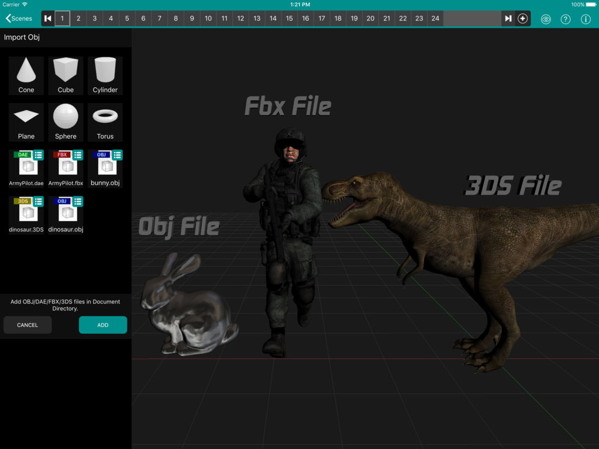
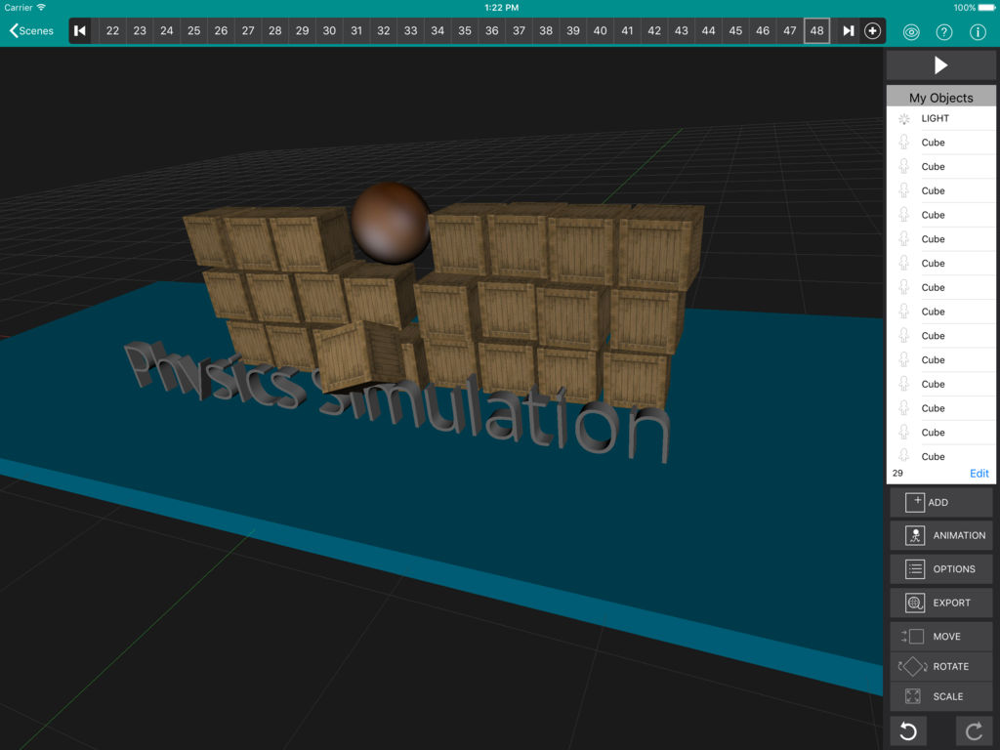

# Iyan3d
A 3D animation app for mobile devices (iOS, Android). Project can be built on both xCode on macOS or Android Studio. The complete source code is made open source with an intention to contribute back to the community. 

### Other Open Source softwares used:
* Open Asset Import Library (assimp - https://github.com/assimp/assimp) 
* FFmpeg (https://github.com/FFmpeg/FFmpeg)
* JCodec (https://github.com/jcodec/jcodec)
* Bullet Physics (https://github.com/bulletphysics/bullet3)
* FTGL (http://sourceforge.net/projects/ftgl)
* Apple's GLKMath library (Re-implementation)
* FreeType2 (https://sourceforge.net/projects/freetype/files/)
* iGLU - OpenGL Utility Library (GLU) for iPhone OS. (https://code.google.com/archive/p/iphone-glu/)
* libpng (http://libpng.sourceforge.net)

And a lot more. Will keep this section update as often as possible. Lots of code were copied from different places and eventually we lost track of where we took. 

### To do
* Check if proper license files are added for various Open Source codes. (These files were missed during commits.)
* Fix bugs in softbody rendering
* Clean code & add more documents

### Contributions
* Harishankar Narayanan (https://github.com/codetiger)
* Previously maintainted at Smackall Games Pvt Ltd

### License
The source code contians other Open Source parts as mentioned in the above list. Rest of the code is released under permissive MIT License. 

### App Store Links
* Iyan 3D (Free) iOS - https://itunes.apple.com/app/id640516535
* Iyan 3D (Professional) iOS - https://itunes.apple.com/app/id1163508489 (Will be made free with next version)
* Iyan 3D (Free Android) - https://play.google.com/store/apps/details?id=com.smackall.animator

### Contact
If you found it useful in your projects, please feel free to write to me nharishankar@gmail.com